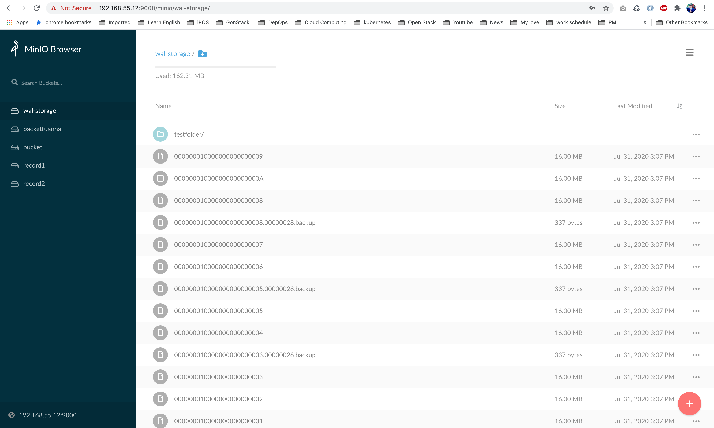

# Tutorial setup watch folder

### setup venv
- setup golang
```
# cd /tmp/
# wget https://golang.org/dl/go1.14.6.linux-amd64.tar.gz
# tar -xvf go1.14.6.linux-amd64.tar.gz go/
# mv go /usr/local
# export GOROOT=/usr/local/go
# export GOPATH=$HOME/go
# export PATH=$GOPATH/bin:$GOROOT/bin:$PATH
# go version
```

- Open your .profile file and add a global variable at the end of the file. You may want to add this into a .zshrc or.bashrc file as per your shell configuration.
```
export GOROOT=/usr/local/go
export GOPATH=$HOME/go
export PATH=$GOPATH/bin:$GOROOT/bin:$PATH
```

- Update current shell session
```
# source ~/.profile
```


### setup mc

- Source installation is intended only for developers and advanced users. mc update command does not support update notifications for source based installations. Please download official releases from https://min.io/download/#minio-client.

- If you do not have a working Golang environment, please follow How to install Golang.
```
# apt install make
# go get -d github.com/minio/mc
# cd ${GOPATH}/src/github.com/minio/mc
# make
```

### Run MinIO Client
- minio
```
# cd ${GOPATH}/src/github.com/minio/mc
# chmod +x mc
# ./mc --help
```

- Config storage host
```
# ./mc config host add minio http://192.168.55.12:9000  AKaHEgQ4II0S7BjT6DjAUDA4BX SKFzHq5iDoQgF7gyPYRFhzNMYSvY6ZFMpH
mc: Configuration written to `/root/.mc/config.json`. Please update your access credentials.
mc: Successfully created `/root/.mc/share`.
mc: Initialized share uploads `/root/.mc/share/uploads.json` file.
mc: Initialized share downloads `/root/.mc/share/downloads.json` file.
Added `minio` successfully.
```

- create new bucket: wal-storage
```
# ./mc mb minio/wal-storage
```

- Cross mirror between sites in a active-active deployment.
```
# ./mc mirror --watch --active-active /wal_archive/ minio/wal-storage # push data to storage
or
# ./mc mirror --watch --active-active minio/wal-storage /wal_archive_recovery/ # pull data to storage
...folder/hello.txt:  160.00 MiB / 160.00 MiB ┃▓▓▓▓▓▓▓▓▓▓▓▓▓▓▓▓▓▓▓▓▓▓▓▓▓▓▓▓▓▓▓▓▓▓▓▓▓▓▓▓▓▓▓▓▓▓▓▓▓▓▓▓▓▓▓▓▓▓▓┃ 3.28 MiB/s
...folder/hello.txt:  160.00 MiB / 160.00 MiB ┃▓▓▓▓▓▓▓▓▓▓▓▓▓▓▓▓▓▓▓▓▓▓▓▓▓▓▓▓▓▓▓▓▓▓▓▓▓▓▓▓▓▓▓▓▓▓▓▓▓▓▓▓▓▓▓▓▓▓▓┃ 3.27 MiB/s
...folder/hello.txt:  160.00 MiB / 160.00 MiB ┃▓▓▓▓▓▓▓▓▓▓▓▓▓▓▓▓▓▓▓▓▓▓▓▓▓▓▓▓▓▓▓▓▓▓▓▓▓▓▓▓▓▓▓▓▓▓▓▓▓▓▓▓▓▓▓▓▓▓▓┃ 3.26 MiB/s
...folder/hello.txt:  160.00 MiB / 160.00 MiB ┃▓▓▓▓▓▓▓▓▓▓▓▓▓▓▓▓▓▓▓▓▓▓▓▓▓▓▓▓▓▓▓▓▓▓▓▓▓▓▓▓▓▓▓▓▓▓▓▓▓▓▓▓▓▓▓▓▓▓▓┃ 3.21 MiB/s...folder/hello.txt:  160.00 MiB / 160.00 MiB ┃▓▓▓▓▓▓▓▓▓▓▓▓▓▓▓▓▓▓▓▓▓▓▓▓▓▓▓▓▓▓▓▓▓▓▓▓▓▓▓▓▓▓▓▓▓▓▓▓▓▓▓▓▓▓▓┃ 3.21 MiB/s 49s
```

- Follow Minio Gui


