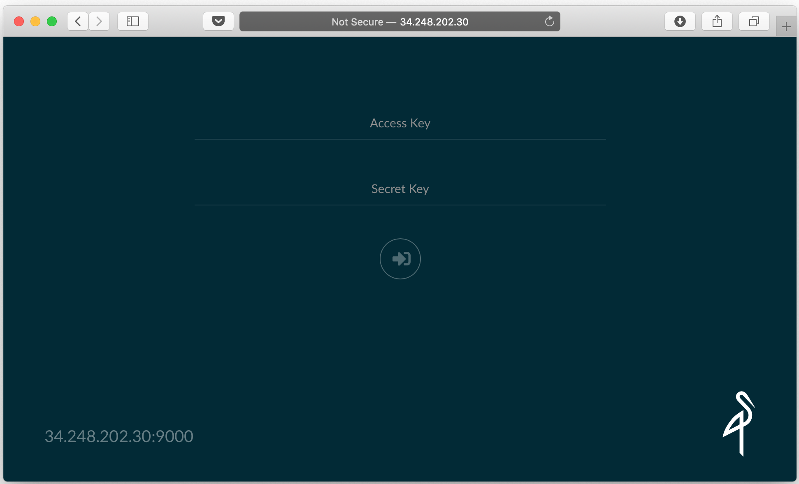

# Setup MINIO cluster

- https://min.io

- In this post we will setup a 4 node minio distributed cluster (4 node is requirment)

- The following steps will need to be applied on all 4 instances.
- check disk
```
$ sudo lsblk
NAME    MAJ:MIN RM SIZE RO TYPE MOUNTPOINT
loop0     7:0    0  89M  1 loop /snap/core/7713
loop1     7:1    0  18M  1 loop /snap/amazon-ssm-agent/1480
xvda    202:0    0   8G  0 disk
└─xvda1 202:1    0   8G  0 part /
xvdb    202:16   0  20G  0 disk
```


- Switch to the root user and mount the secondary disk to the /data directory:
```
$ sudo su
$ mkdir /data
$ mkfs.xfs /dev/xvdb
$ echo "/dev/xvdb /data xfs defaults,noatime,nofail 0 0" >> /etc/fstab
$ mount -a
$ reboot
```
- Verify that the disk has been mounted:
```
$ df -h
Filesystem      Size  Used Avail Use% Mounted on
/dev/xvda1      7.7G  1.3G  6.5G  17% /
/dev/xvdb        20G   53M   20G   1% /data
```

- After you have mounted the disks on all 4 instances, gather the private ip addresses and set your host files on all 4 instances (in my case):
```
$ cat > /etc/hosts << EOF
172.31.38.98    minio-1
172.31.39.214    minio-2
172.31.37.208    minio-3
172.31.42.115    minio-4
127.0.0.1     localhost
EOF
```
- Install Minio
- Install minio on each node:
```
$ apt update && apt install wget -y
$ wget -O /usr/local/bin/minio https://dl.minio.io/server/minio/release/linux-amd64/minio
$ chmod +x /usr/local/bin/minio
```

- After minio has been installed on all the nodes, create the systemd unit files on the nodes:
    ```
    $ cat > /lib/systemd/system/minio.service << EOF
    [Unit]
    Description=minio
    Documentation=https://docs.min.io
    Wants=network-online.target
    After=network-online.target
    AssertFileIsExecutable=/usr/local/bin/minio

    [Service]
    WorkingDirectory=/usr/local/
    User=root
    Group=root
    EnvironmentFile=/etc/default/minio
    ExecStart=/usr/local/bin/minio server \$MINIO_OPTS
    Restart=always
    LimitNOFILE=65536
    TimeoutStopSec=infinity
    SendSIGKILL=no

    [Install]
    WantedBy=multi-user.target
    EOF
    ```

- In my case, I am setting my access key to ```AKaHEgQ4II0S7BjT6DjAUDA4BX``` and my secret key to ```SKFzHq5iDoQgF7gyPYRFhzNMYSvY6ZFMpH```, therefore I am setting this to the minio's default configuration:
```
$ cat > /etc/default/minio << EOF
MINIO_OPTS="http://minio-1:9000/data http://minio-2:9000/data http://minio-3:9000/data http://minio-4:9000/data"
MINIO_ACCESS_KEY="AKaHEgQ4II0S7BjT6DjAUDA4BX"
MINIO_SECRET_KEY="SKFzHq5iDoQgF7gyPYRFhzNMYSvY6ZFMpH"
EOF
```

- When the above step has been applied to all the nodes, reload the systemd daemon, enable the service on boot and start the service on all the nodes:
```
$ systemctl daemon-reload
$ systemctl enable minio
$ systemctl start minio.service
```

- Head over to any node and run a status to see if minio has started:
    ```
    $ systemctl status minio.service
      minio.service - minio
       Loaded: loaded (/lib/systemd/system/minio.service; enabled; vendor preset: enabled)
       Active: active (running) since Wed 2019-10-09 17:47:15 UTC; 1min 16s ago
         Docs: https://docs.min.io
    Main PID: 2089 (minio)
        Tasks: 8 (limit: 1152)
       CGroup: /system.slice/minio.service
               └─2089 /usr/local/bin/minio server http://minio-1:9000/data http://minio-2:9000/data http://minio-3:9000/data http://minio-4:9000/data

    Oct 09 17:47:24 ip-172-31-38-98 minio[2089]: Status:         4 Online, 0 Offline.
    Oct 09 17:47:24 ip-172-31-38-98 minio[2089]: Endpoint:  http://172.31.38.98:9000  http://127.0.0.1:9000
    Oct 09 17:47:24 ip-172-31-38-98 minio[2089]: Browser Access:
    Oct 09 17:47:24 ip-172-31-38-98 minio[2089]:    http://172.31.38.98:9000  http://127.0.0.1:9000
    Oct 09 17:47:24 ip-172-31-38-98 minio[2089]: Object API (Amazon S3 compatible):
    Oct 09 17:47:24 ip-172-31-38-98 minio[2089]:    Go:         https://docs.min.io/docs/golang-client-quickstart-guide
    Oct 09 17:47:24 ip-172-31-38-98 minio[2089]:    Java:       https://docs.min.io/docs/java-client-quickstart-guide
    Oct 09 17:47:24 ip-172-31-38-98 minio[2089]:    Python:     https://docs.min.io/docs/python-client-quickstart-guide
    Oct 09 17:47:24 ip-172-31-38-98 minio[2089]:    JavaScript: https://docs.min.io/docs/javascript-client-quickstart-guide
    Oct 09 17:47:24 ip-172-31-38-98 minio[2089]:    .NET:       https://docs.min.io/docs/dotnet-client-quickstart-guide
    ```

- As you can see, all 4 nodes has started.

- Minio WebUI
- Get the public ip of one of your nodes and access it on port 9000:


